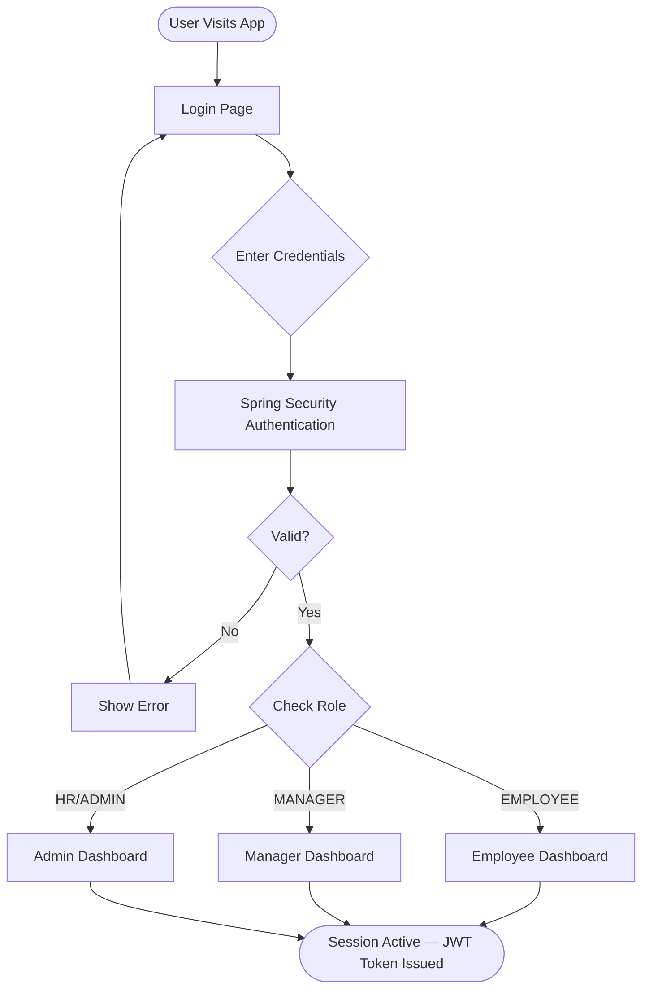
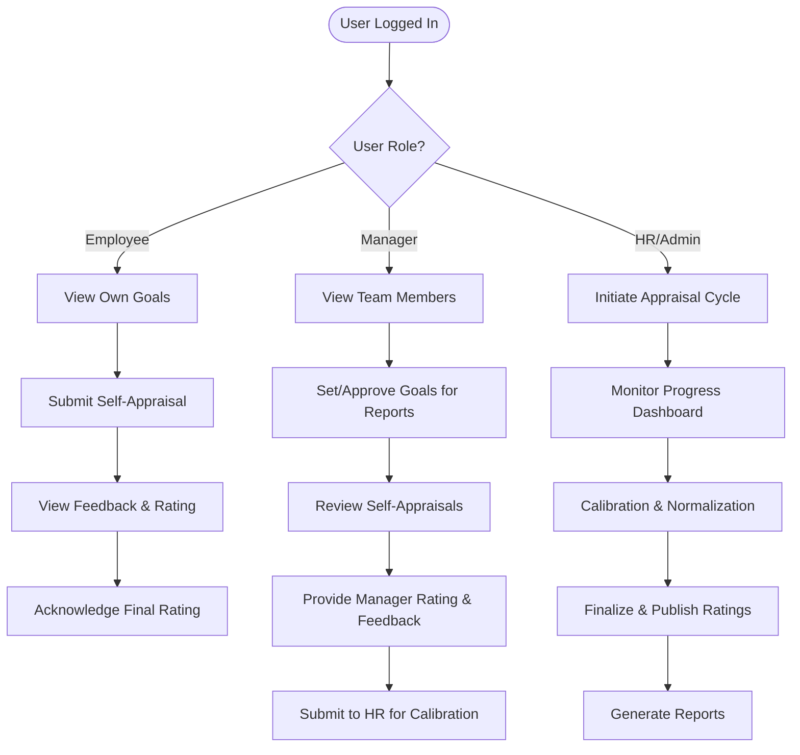
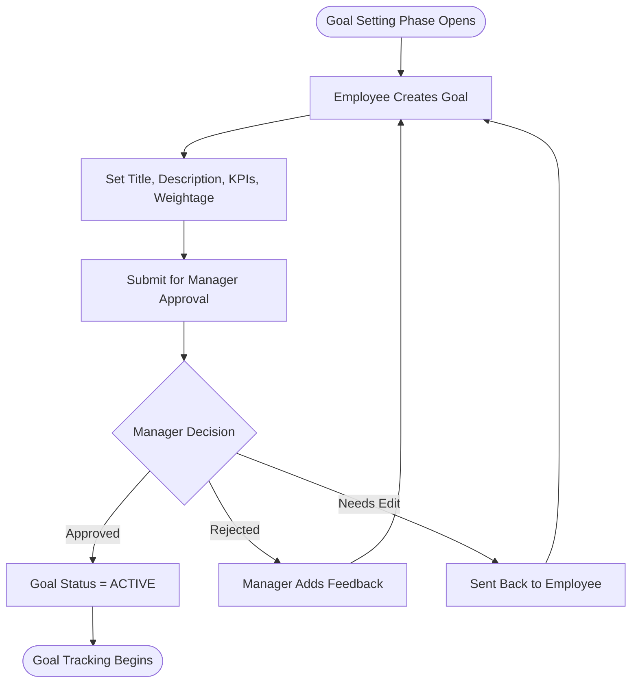
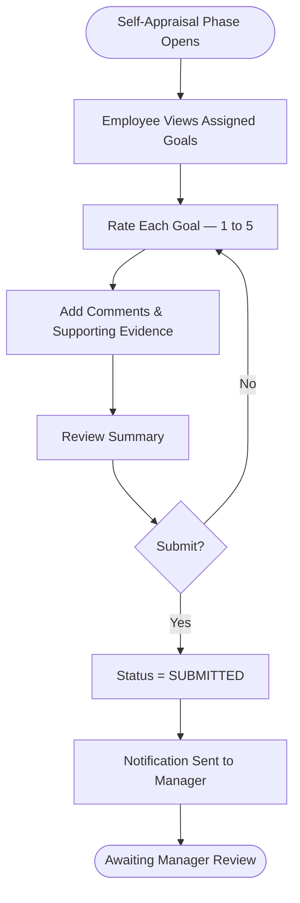
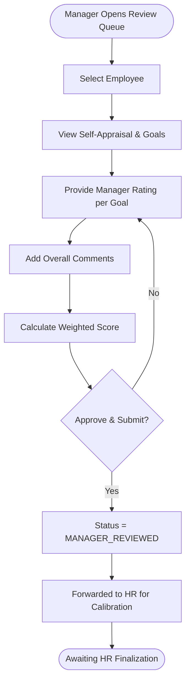
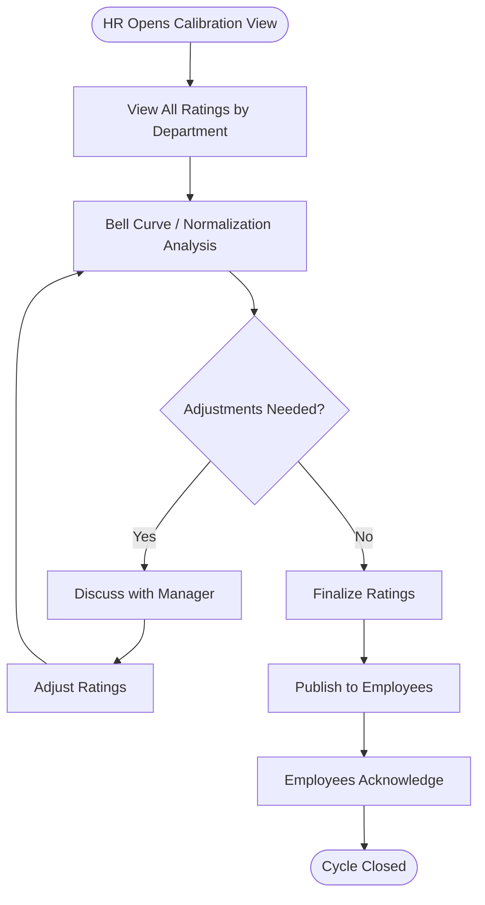
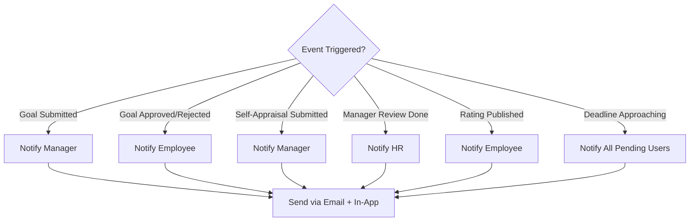
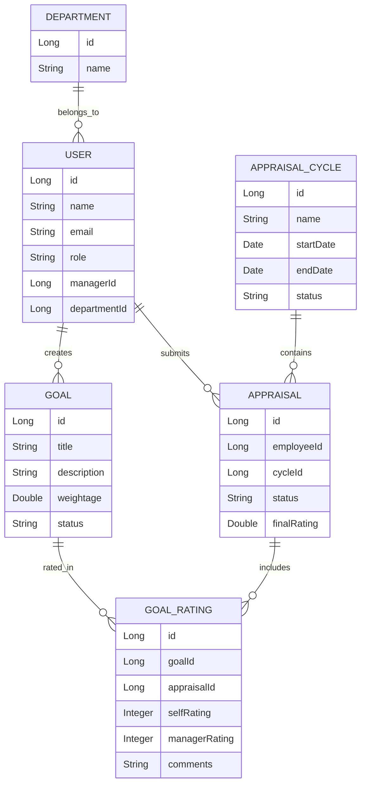

# Appraisal System — Application Flowchart

## System Overview

A **Performance Appraisal System** with role-based access for **Employees**, **Managers**, and **HR/Admin**. Built with Java Spring Boot (backend) + a web frontend.

---

## 1. Authentication & Authorization Flow

---

## 2. High-Level Application Flow

---

## 3. Appraisal Cycle Lifecycle

```mermaid
flowchart LR
    subgraph "Phase 1: Setup"
        P1A[HR Creates Cycle] --> P1B[Define Rating Scale]
        P1B --> P1C[Set Deadlines]
    end

    subgraph "Phase 2: Goal Setting"
        P2A[Employee Sets Goals] --> P2B[Manager Reviews Goals]
        P2B --> P2C{Approved?}
        P2C -- No --> P2A
        P2C -- Yes --> P2D[Goals Finalized]
    end

    subgraph "Phase 3: Self-Appraisal"
        P3A[Employee Rates Own Goals]
        P3A --> P3B[Adds Achievements & Evidence]
        P3B --> P3C[Submits Self-Appraisal]
    end

    subgraph "Phase 4: Manager Review"
        P4A[Manager Reviews Submission]
        P4A --> P4B[Provides Rating & Comments]
        P4B --> P4C[Submits to HR]
    end

    subgraph "Phase 5: Finalization"
        P5A[HR Calibrates Ratings]
        P5A --> P5B[Final Rating Published]
        P5B --> P5C[Employee Acknowledges]
    end

    P1C --> P2A
    P2D --> P3A
    P3C --> P4A
    P4C --> P5A
```

---

## 4. Goal Management Flow

---

## 5. Self-Appraisal Submission Flow

---

## 6. Manager Review Flow

---

## 7. HR Calibration & Finalization Flow

---

## 8. Notification System Flow

---

## 9. Key Entities (Data Model Overview)

---

## 10. API Layer Overview

| Module | Endpoint Prefix | Key Operations |
|---|---|---|
| **Auth** | `/api/auth` | Login, Register, Refresh Token |
| **Users** | `/api/users` | CRUD, Profile, Role Mgmt |
| **Cycles** | `/api/cycles` | Create, Start, Close Cycle |
| **Goals** | `/api/goals` | Create, Approve, Reject |
| **Appraisals** | `/api/appraisals` | Submit, Review, Finalize |
| **Ratings** | `/api/ratings` | Self-Rate, Manager-Rate, Calibrate |
| **Reports** | `/api/reports` | Department, Individual, Bell Curve |
| **Notifications** | `/api/notifications` | List, Mark Read |

---

## Tech Stack Recommendation

| Layer | Technology |
|---|---|
| Backend | Java 17+ / Spring Boot 3.x |
| Security | Spring Security + JWT |
| Database | PostgreSQL / MySQL |
| ORM | Spring Data JPA / Hibernate |
| API Docs | SpringDoc OpenAPI (Swagger) |
| Frontend | React / Angular / Thymeleaf |
| Notifications | Spring Mail + WebSocket |
| Build | Maven / Gradle |

